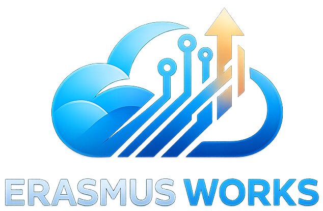

<p align="center">
  
</p>

<p align="center">My Homelab Kubernetes repo for a Talos cluster, with a simple GitOps workflow using Argo CD.</p>

## Overview

This repository manages my single-node homelab Kubernetes cluster with a small
GitOps setup built around Talos Linux, Kubernetes, and Argo CD.

| Area | Choice |
| --- | --- |
| OS | Talos Linux |
| Orchestration | Kubernetes |
| GitOps | Argo CD |
| Load balancing | MetalLB |
| In-cluster ingress | Envoy Gateway |
| Public access | Cloudflare Tunnel |
| Storage | Longhorn |
| Backup | VolSync |
| Database operator | CloudNativePG |
| Secret sync | External Secrets Operator + Bitwarden Secrets Manager |
| Metrics | kube-prometheus-stack |
| Logs | VictoriaLogs + Fluent Bit |

## Core Components

**Platform:** [Talos Linux](https://www.talos.dev/) runs the node and
[Kubernetes](https://kubernetes.io/) provides the cluster runtime.

**GitOps:** [Argo CD](https://argo-cd.readthedocs.io/) manages the repo with an
app-of-apps layout rooted at `kubernetes/clusters/homelab`.

**Networking:** [MetalLB](https://metallb.io/) provides `LoadBalancer` IPs, and
[Envoy Gateway](https://gateway.envoyproxy.io/) handles in-cluster ingress.

**Edge Access:** [Cloudflare Tunnel](https://developers.cloudflare.com/cloudflare-one/connections/connect-networks/)
publishes selected services externally.

**Secrets:** [External Secrets Operator](https://external-secrets.io/) reads
from Bitwarden Secrets Manager and creates in-cluster Kubernetes secrets.

**Data Services:** [Longhorn](https://longhorn.io/) provides persistent storage,
[VolSync](https://volsync.readthedocs.io/) handles scheduled PVC backups, and
[CloudNativePG](https://cloudnative-pg.io/) manages PostgreSQL workloads.

**Observability:** [kube-prometheus-stack](https://github.com/prometheus-community/helm-charts/tree/main/charts/kube-prometheus-stack)
provides Prometheus, Grafana, and Alertmanager. [VictoriaLogs](https://docs.victoriametrics.com/victorialogs/)
stores in-cluster logs, and [Fluent Bit](https://fluentbit.io/) collects and
forwards them for search through Grafana.

## Storage

Longhorn is installed for persistent storage. This is currently a single-node
setup, so the default replica count is `1` by design. Longhorn data currently
lives at `/var/lib/longhorn` on the node SSD. VolSync is installed for
scheduled filesystem backups of app PVCs. CloudNativePG is installed as the
PostgreSQL operator for in-cluster database workloads.

## Cloud Dependencies

This setup is mostly self-hosted, but it still depends on a few cloud services.

| Service | Use |
| --- | --- |
| [Cloudflare](https://www.cloudflare.com/) | DNS, public edge access, Cloudflare Tunnel |
| [Bitwarden Secrets Manager](https://bitwarden.com/products/secrets-manager/) | External secret source for Kubernetes |
| [GitHub](https://github.com/) | Git hosting and Argo CD source of truth |

## Repository Structure

```text
.
├── 📁 kubernetes/
│   ├── 📁 bootstrap/argocd/   # Argo CD bootstrap
│   ├── 📁 clusters/homelab/   # Cluster entrypoint and child apps
│   ├── 📁 infra/              # Infra manifests and infra-level Argo apps
│   └── 📁 apps/               # App manifests
├── 📁 talos/                  # Talos configs
├── 📁 linux/                  # Local workstation helpers
└── 📁 docs/                   # Runbooks and notes
```

## Hardware

| Component | Details |
| --- | --- |
| Kubernetes node | MINIS FORUM UN1245 Mini-PC |
| CPU | Intel Core i5-12450H |
| iGPU | Intel UHD Graphics |
| Memory | 16 GB RAM |
| Storage | 512 GB SSD |
| Router | UniFi Express 7 (UX7) |
| Switch | 2.5 Gbps switch |

## Documentation

- [Talos Bootstrap Runbook](docs/bootstrap/talos.md)
- [Argo CD Bootstrap Runbook](docs/bootstrap/argocd.md)
- [Bitwarden External Secrets Bootstrap](docs/bootstrap/bitwarden-external-secrets.md)
- [Longhorn Bootstrap Notes](docs/bootstrap/longhorn.md)
- [VolSync Restic Notes](docs/volsync-restic.md)
- [Linux Init Script](linux/init.md)
