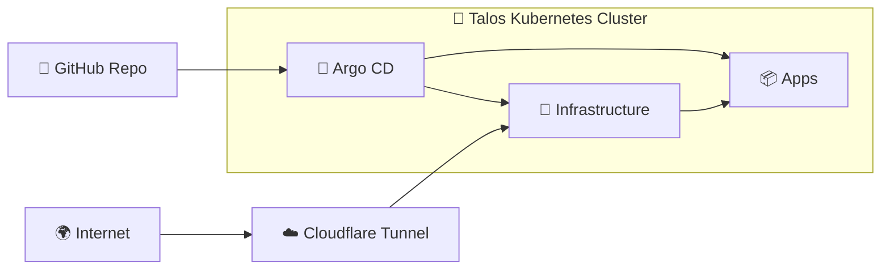

<p align="center">
  
</p>

<div align="center">

[](https://kubernetes.io/)&nbsp;&nbsp;
[](https://www.talos.dev/)&nbsp;&nbsp;
[](https://argocd.erasmus.works/)

</div>

<div align="center">

[](https://grafana.erasmus.works/)&nbsp;&nbsp;
[](https://prometheus.erasmus.works/)&nbsp;&nbsp;
[](https://alertmanager.erasmus.works/)

</div>

<div align="center">

[](https://kromgo.erasmus.works/cluster_age_days)&nbsp;&nbsp;
[](https://kromgo.erasmus.works/cluster_uptime_days)&nbsp;&nbsp;
[](https://kromgo.erasmus.works/cluster_node_count)&nbsp;&nbsp;
[](https://kromgo.erasmus.works/cluster_pod_count)&nbsp;&nbsp;
[](https://kromgo.erasmus.works/cluster_cpu_usage)&nbsp;&nbsp;
[](https://kromgo.erasmus.works/cluster_memory_usage)&nbsp;&nbsp;
[](https://kromgo.erasmus.works/cluster_alert_count)

<p align="center">My Homelab Kubernetes repo for a Talos cluster, with a simple GitOps workflow using Argo CD.</p>

</div>

---

## Overview

This repository is the source of truth for my personal homelab Kubernetes cluster. I
try to keep things simple and reproducible by following Infrastructure as Code
(IaC) and GitOps practices with tools like Talos, Kubernetes, Argo CD, and
Renovate.

---

## Kubernetes

My Kubernetes cluster is deployed with [Talos Linux](https://www.talos.dev/).
It is a single-node setup built to stay simple, low-maintenance, and reliable
for the services I actually run, and will be expanded on with more nodes soon.

### Core Components

- [MetalLB](https://metallb.io/): Provides `LoadBalancer` IPs on the local network.
- [Envoy Gateway](https://gateway.envoyproxy.io/): Handles in-cluster ingress and HTTP routing.
- [Cloudflare Tunnel](https://developers.cloudflare.com/cloudflare-one/connections/connect-networks/): Publishes selected services externally without opening inbound ports.
- [ExternalDNS](https://kubernetes-sigs.github.io/external-dns/latest/): Syncs DNS records to Cloudflare.
- [External Secrets Operator](https://external-secrets.io/): Syncs Kubernetes secrets from Bitwarden Secrets Manager.
- [Longhorn](https://longhorn.io/): Provides persistent volumes for stateful workloads.
- [CloudNativePG](https://cloudnative-pg.io/): Runs PostgreSQL workloads in-cluster.
- [VolSync](https://volsync.readthedocs.io/): Handles scheduled PVC backups.
- [Garage](https://garagehq.deuxfleurs.fr/): Provides S3-compatible object storage for backup workflows.
- [kube-prometheus-stack](https://github.com/prometheus-community/helm-charts/tree/main/charts/kube-prometheus-stack): Provides Prometheus, Grafana, and Alertmanager.
- [VictoriaLogs](https://docs.victoriametrics.com/victorialogs/): Stores cluster logs.
- [Fluent Bit](https://fluentbit.io/): Collects and forwards logs into VictoriaLogs.

### GitOps

Argo CD watches the manifests in my [`kubernetes`](/home/andre/code/ew/erasmus.works/kubernetes)
folder and makes changes to my cluster based on the state of my Git repository.

Renovate watches my repository for dependency updates, and when they are found
a pull request is automatically created. When pull requests are merged Argo CD
applies the changes to my cluster.



### Directories

This Git repository contains the following directories.

```text
.
├── 📁 kubernetes/
│   ├── 📁 clusters/homelab/   # Cluster root and top-level Argo CD applications
│   ├── 📁 infra/              # Shared platform services
│   └── 📁 apps/               # User-facing workloads
├── 📁 talos/                  # Talos machine config and patches
├── 📁 docs/                   # Practical runbooks and notes
└── 📁 linux/                  # Local workstation/helper files
```

---

## Cloud Dependencies

While most of my infrastructure and workloads are self-hosted, I do rely upon
the cloud for a few key parts of my setup. This keeps the setup simpler and
avoids making the cluster responsible for every critical dependency.

| Service | Use | Cost |
| --- | --- | --- |
| [Cloudflare](https://www.cloudflare.com/) | Domain, DNS, Zero Trust Tunnel | ~€22/yr |
| [Bitwarden Secrets Manager](https://bitwarden.com/products/secrets-manager/) | External secret source for Kubernetes | ~€18/yr |
| [SMTP2GO](https://www.smtp2go.com/) | Outbound email delivery for cluster apps | Free |
| [GitHub](https://github.com/) | Git hosting and Argo CD source of truth | Free |
|  |  | Total: ~€3.35/mo |

---

## Hardware

This cluster runs on a single small-form-factor node, which keeps the setup
simple and inexpensive while still being enough for the workloads in this repo.

| Component | Details |
| --- | --- |
| Kubernetes node | MINIS FORUM UN1245 Mini-PC |
| CPU | Intel Core i5-12450H |
| iGPU | Intel UHD Graphics |
| Memory | 16 GB RAM |
| Storage | 512 GB SSD |
| Router | UniFi Express 7 (UX7) |
| Switch | 2.5 Gbps switch |

---

## Documentation

- [Talos Bootstrap Runbook](/home/andre/code/ew/erasmus.works/docs/bootstrap/talos.md)
- [Bitwarden External Secrets Bootstrap](/home/andre/code/ew/erasmus.works/docs/bootstrap/bitwarden-external-secrets.md)
- [Longhorn Bootstrap Notes](/home/andre/code/ew/erasmus.works/docs/bootstrap/longhorn.md)
- [Kubernetes Inventory](/home/andre/code/ew/erasmus.works/docs/kubernetes-inventory.md)
- [Kubernetes Layout Notes](/home/andre/code/ew/erasmus.works/docs/kubernetes-layout.md)
- [VolSync Restic Notes](/home/andre/code/ew/erasmus.works/docs/volsync-restic.md)
- [Garage Notes](/home/andre/code/ew/erasmus.works/docs/garage.md)
- [Linux Init Notes](/home/andre/code/ew/erasmus.works/linux/init.md)
- [Renovate Config](/home/andre/code/ew/erasmus.works/renovate.json)
